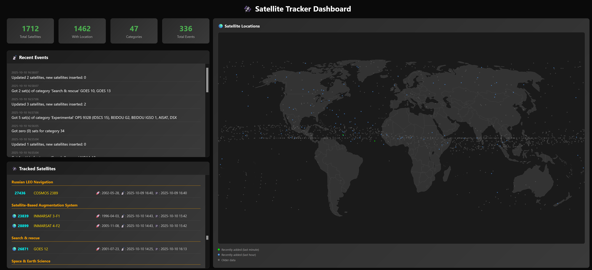

# Space Tracker

#DISCLAIMER: This entire project was made by copilot, not a single line of code touched (and copilot even did some of the commit messages for me).

A real-time satellite tracking application that collects data from the N2YO API and provides both console and web-based visualization of satellite positions and statistics.



## Features

- **Dual Mode Operation**: Console commands for quick data access and web dashboard for visual tracking
- **Real-time Satellite Tracking**: Fetches live satellite data from N2YO API
- **Interactive World Map**: Visual representation of satellite positions with detailed tooltips
- **Comprehensive Statistics**: Track satellite counts, categories, and events
- **Auto-refresh Dashboard**: Updates every minute with latest satellite data
- **Cross-platform Compatibility**: Works on Windows, Linux, and macOS

## Getting Started

### Prerequisites

- .NET 9.0 SDK
- Internet connection (for N2YO API access)

### Installation

1. Clone the repository
2. Navigate to the project directory
3. Build the application:
   ```bash
   dotnet build
   ```

## Usage

### Console Mode

```bash
# Run the main loop (collect satellite data)
dotnet run

# View satellites
dotnet run -- sats

# View statistics  
dotnet run -- stats

# View events
dotnet run -- events
```

### Web Dashboard Mode

```bash
# Start web server with dashboard
dotnet run -- web
```

Then open your browser to: `http://localhost:5000`

## Web Dashboard Features

- **Real-time Statistics**: Total satellites, satellites with location data, categories, and events
- **Interactive World Map**: Visual satellite positions with color-coded activity levels:
  - 🟢 Green: Recently active (last minute)
  - 🔵 Blue: Active today (last hour) 
  - ⚫ Grey: Older data (inactive)
- **Live Satellite List**: Grouped by category with location indicators (🌍)
- **Recent Events Timeline**: Latest activity and updates with timestamps
- **Auto-refresh**: Updates every minute automatically
- **Responsive Design**: Works on desktop and mobile devices
- **Dark Theme**: Professional dark UI optimized for extended viewing

## API Endpoints

The web mode exposes REST endpoints for programmatic access:

- `GET /api/stats` - Returns satellite and event statistics
- `GET /api/satellites?limit=100` - Returns satellite list (default: unlimited)
- `GET /api/events?limit=50` - Returns recent events (default: 50)

## Technical Details

### Architecture

- **ASP.NET Core**: Web framework for hosting and API endpoints
- **LiteDB**: Local database for satellite and event storage
- **Background Services**: Continuous data collection from N2YO API
- **Vanilla JavaScript**: Client-side dashboard with no external dependencies

### Data Sources

- **N2YO API**: Real-time satellite tracking data (https://api.n2yo.com)
- **SVG World Map**: Custom geographical visualization

### Cross-Platform Compatibility

Tested and working on:
- Windows (PowerShell, Command Prompt)
- Linux (bash, zsh)
- macOS (Terminal)

## Dependencies

- **.NET 9.0**: Core runtime and web framework
- **LiteDB**: Embedded NoSQL database for data persistence
- **Microsoft.Extensions.Http**: HTTP client for API communication
- **Microsoft.Extensions.DependencyInjection**: Dependency injection container

## Contributing

1. Fork the repository
2. Create a feature branch
3. Make your changes
4. Test both console and web modes
5. Submit a pull request

## License

This project uses the N2YO API for satellite data. Please respect their API terms of use.

## Screenshot

The web dashboard provides a comprehensive view of satellite tracking data with an interactive world map, real-time statistics, and detailed satellite listings.
